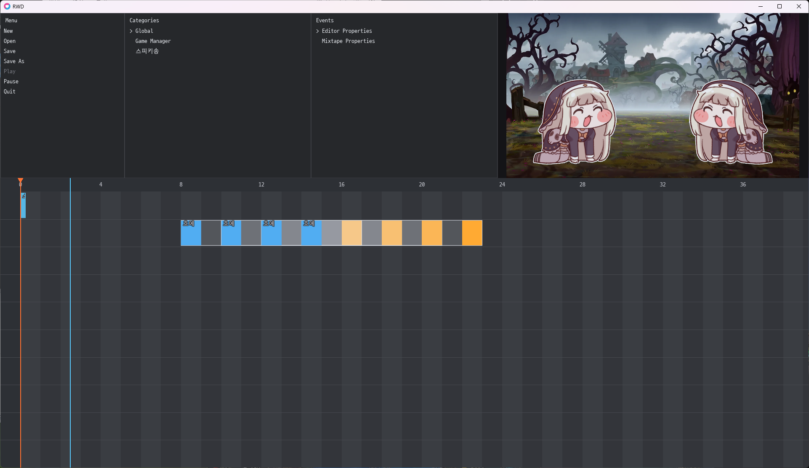
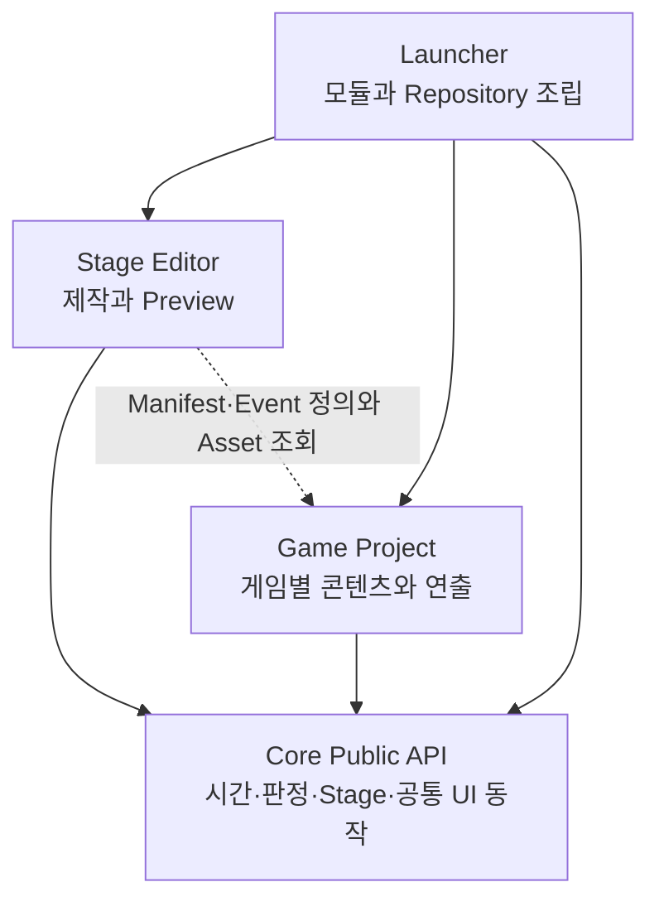
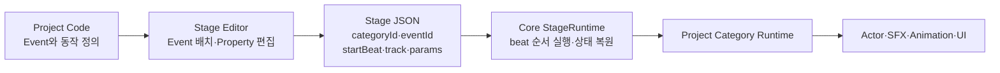

# RWD

**하나의 Rhythm Game Core와 Timeline Stage Editor로 여러 독립 리듬게임 Project를 제작하기 위한 LÖVE2D 기반 제작 시스템**

`LÖVE2D 11.5` · `Lua` · `JSON` · `Stage Editor` · `Data-Driven` · `AI-assisted Development`



## Goal

여러 리듬게임을 만들 때 판정, 음악 재생과 Stage 실행 규칙을 게임마다 다시 구현하지 않기 위해 시작했습니다. 공통 규칙은 Core에 두고, 캐릭터·사운드·화면 연출은 각 Game Project가 독립적으로 소유합니다.

Project 코드로 Event와 동작을 정의하고, Stage Editor에서 시간축과 Property를 편집한 뒤 실제 Project 화면으로 즉시 시험하는 제작 흐름을 목표로 합니다.

## Architecture



### Core

판정, 음악 시간축, Stage 형식·저장·실행과 스타일 독립적인 UI 동작을 공개 API로 제공합니다. Core는 Editor와 구체적인 Game Project를 알지 못합니다.

### Stage Editor

Project가 등록한 Event를 Timeline에 배치하고 Stage 설정을 편집합니다. 같은 화면에서 음악, Metronome과 Project Canvas를 함께 재생해 결과를 확인합니다.

### Game Project

Event 정의와 Actor, Sprite, SFX, UI, 애니메이션을 소유합니다. Core를 사용하지만 Editor에는 의존하지 않으므로 게임별 코드와 리소스를 Project 안에 유지할 수 있습니다.

### Launcher

`StageRepository` 하나를 구성해 Editor, Editor Preview와 독립 실행 Project에 주입합니다. 게임 규칙이나 Editor 기능은 구현하지 않습니다.

이 경계는 **공통 실행 규칙과 게임별 표현을 분리하면서 Editor Preview와 실제 게임의 동작 차이를 줄이기 위해** 선택했습니다. 금지된 모듈 의존 방향은 자동 테스트로 검사합니다.

## 제작 Workflow



**게임 동작은 Project 코드가 소유합니다.** Stage JSON에는 게임 로직 전체가 아니라 Editor에서 정한 Event의 시간·Track·Property를 저장합니다.

현재 Project Event는 다음처럼 Category와 Event의 조합으로 저장됩니다.

```json
{
  "type": "projectEvent",
  "categoryId": "speakiSong",
  "eventId": "heue",
  "startBeat": 8,
  "track": 2,
  "params": {
    "responseDelayBeats": 8,
    "longNoteLengthBeats": 1
  }
}
```

서로 다른 Category는 같은 Event ID를 사용할 수 있습니다. 일반 Pattern 참조와 Tap/Long 일정 전개는 아직 구현되지 않았으며, 현재 제작 흐름의 중심은 Project Event입니다.

## My Role / AI-assisted Development

이 프로젝트는 AI Agent를 코드 자동완성에만 사용한 것이 아니라, 요구사항과 제작 Workflow를 정의하고 Agent와 설계·구현·수정을 반복하는 방식으로 개발했습니다.

### My Role

- 화면에 노트를 표시하지 않는 Cue/Response 게임 방향과 Tap/Long 입력 모델 정의
- Core / Editor / Project 책임 분리의 제품 방향 결정
- Stage JSON은 배치·설정, Project 코드는 게임 동작을 소유하도록 책임 경계 결정
- Timeline, Snap, Playback, Preview와 Property 편집 UX 요구사항 설계
- Project Category 단위 확장과 Project별 독립 리소스 방향 결정
- 실제 실행·청취를 통한 Metronome, Pause/Play, Tap/Long 분류와 SFX 구조 수정
- 구현 결과 확인과 후속 구조 개선 우선순위 결정

### AI Agent Contribution

- Codex와 Pi Agent를 이용한 코드 구현과 반복 수정
- 세부 클래스·파일 구조 및 일부 모듈 경계 대안 제안
- 음악 동기화, 입력 처리, 저장과 UI 상태 등 저수준 구현
- 자동 테스트 작성·실행, 코드 리뷰와 회귀 문제 보완
- 설계·작업 계획과 기술 문서 초안 작성

구현은 Codex와 Pi Agent를 적극 활용했으며, 현재 주요 실행 경로를 직접 분석하고 주석화하며 코드 이해 범위를 넓히고 있습니다.

## Stage Editor

### Timeline Editing

- Event 배치·Snap·다중 선택과 그룹 이동
- Property와 상대 위치를 보존하는 Copy / Cut / Paste, Undo / Redo
- Cursor 기준 Zoom·Pan과 실제 beat 폭 기반 충돌 Preview

### Playback & Preview

- 편집 기준선과 실제 재생 위치선 분리
- Music Offset·Metronome·Playback Rate를 이용한 구간 테스트
- 선택한 기준 beat부터 실제 Game Project 화면 실시간 Preview

### Stage Management

- Project·Stage·Music 선택과 New / Open / Save / Save As
- schemaVersion 3 Stage 검증과 셀 기반 Property 편집
- 오류 Modal과 충돌 Toast

코드를 다시 수정하지 않고 Stage의 시간축과 Event 배치를 반복 조정하고, 같은 화면에서 실제 Project 연출을 확인할 수 있도록 구성했습니다.

## Game Project Examples

### Sample

Core Tap 판정, Category 등록과 Cue/Response Event 제작 방식을 보여주는 참고 Project입니다. 새 Project 제작자가 Core와 Project의 책임 경계를 확인할 수 있도록 구성했습니다.

### Rhythm Dotgeo — 스피키송

같은 Core와 Editor 위에 별도 게임 규칙과 리소스를 올린 Project입니다.

- Stage 선택과 독립 실행
- Cue/Response 기반 Tap·Long Event와 실제 입력 시간(ms) 기반 분류
- Actor, SFX와 역할 전환에 맞춘 자동 Turn
- Project JSON 설정을 Play마다 다시 읽어 배치·반응·SFX 수정 반영

Sample과 Rhythm Dotgeo는 서로 다른 콘텐츠를 가지지만 같은 Stage 형식, Core 판정과 실행 계약을 사용합니다.

## 기술적으로 흥미로운 결정

### 1. Stage JSON과 Project Code의 책임 분리

**문제:** 게임 로직 전체를 JSON에 넣으면 복잡한 Actor·SFX 연출을 표현하기 어렵고, 모두 코드에 두면 Stage마다 타이밍을 조정하기 어렵습니다.

**결정:** Project 코드가 Event 동작을 소유하고 Stage JSON은 `categoryId`, `eventId`, `startBeat`, `params`만 저장합니다.

**효과:** 연출 코드를 유지한 채 Editor에서 시간축과 Property를 반복 조정할 수 있습니다.

### 2. Category 폴더 자동 발견

**문제:** 새 기능을 추가할 때 중앙 Registry와 Game 진입 파일을 매번 수정하면 Category 사이의 결합이 커집니다.

**결정:** `game/<CategoryName>/Definition.lua`와 `Runtime.lua` 쌍을 Core가 자동 발견합니다. Definition은 Editor가 읽는 순수 등록 정보이고 Runtime은 실제 게임 실행만 담당합니다.

**효과:** 기존 Category와 Game 진입 모듈을 수정하지 않고 기능 폴더 하나로 Editor 등록과 Runtime 실행을 연결할 수 있습니다.

### 3. 중간 beat 시작 상태 복원

**문제:** Editor에서 Stage 중간부터 재생하면 이전 Event가 만든 입력 상태나 Actor 배치가 누락될 수 있습니다.

**결정:** `StageRuntime`이 시작 beat까지의 Event를 `catchUp` occurrence로 전달합니다. Project는 지속 상태는 복원하고 이미 지난 SFX 같은 일회성 연출은 생략합니다.

**효과:** 전체 Stage를 처음부터 재생하지 않고도 원하는 구간을 반복 시험할 수 있습니다.

## Repository Structure

```text
core/          시간·음악·판정·Stage 형식과 실행·공통 UI 동작
editor/        Timeline 편집, Stage 관리와 Project Preview
launcher/      Core, Editor와 Project 조립
projects/      서로 독립적인 Sample·Rhythm Dotgeo 게임 코드와 리소스
tests/         LÖVE 기반 Core·Editor·Project 회귀 테스트
tests_python/  Project 생성기 테스트
tools/         새 Project 생성 도구
docs/          Architecture, Workflow, Stage 형식과 제작 튜토리얼
```

## Run / Test

### Requirements

- LÖVE2D 11.5
- LuaJIT / Lua 5.1 호환 환경
- Python 3 — Project 생성기 테스트

### Run

```powershell
love .
```

- `E`: Stage Editor
- `1`: Sample Project
- `2`: Rhythm Dotgeo Stage 선택 화면
- `Esc`: Project에서 Launcher로 복귀, Launcher에서는 종료

### Test

```powershell
love . --test
python -m unittest discover -s tests_python -v
```

검증 결과 LÖVE test suite 339건과 Python Project 생성기 테스트 5건이 모두 통과합니다.

## Documentation

- [Architecture](docs/ARCHITECTURE.md) — 현재 모듈 책임, 공개 API와 데이터 흐름
- [Workflow](docs/WORKFLOW.md) — Project 생성부터 Stage 편집·재생까지의 제작 흐름
- [Stage Format](docs/STAGE_FORMAT.md) — schemaVersion 3 JSON 계약
- [Project Node Tutorial](docs/PROJECT_NODES_TUTORIAL.md) — Category와 Event 제작 방법
- [Roadmap](docs/ROADMAP.md) — 완료·진행·보류 기능
- [Handoff](docs/HANDOFF.md) — 현재 상태, 최신 검증과 다음 작업

## Current Status / Limitations

### Implemented

- Core 음악 Transport와 Tap·Long 판정
- schemaVersion 3 Stage 검증·저장과 Project Event 실행
- Timeline 기반 Stage Editor와 Project 실시간 Preview
- Sample 및 Rhythm Dotgeo Project 실행
- Project Category 자동 발견과 `categoryId + eventId` dispatch

### In Progress

- Editor와 Project가 각각 조립하는 StageRuntime을 단일 실행 권위로 통합

### Planned / Deferred

- 일반 Pattern 참조와 Tap/Long 일정 전개
- Launcher의 동적 Project 메뉴
- EditorApp과 EditorSession 책임 추가 분리
- 선택 Project별 독립 Packaging
